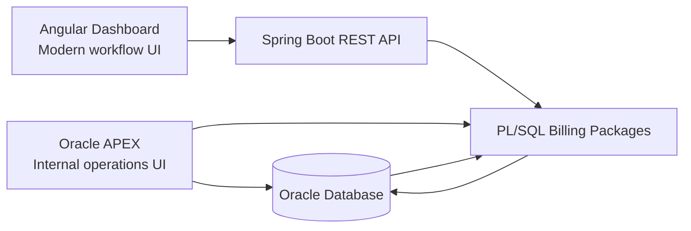
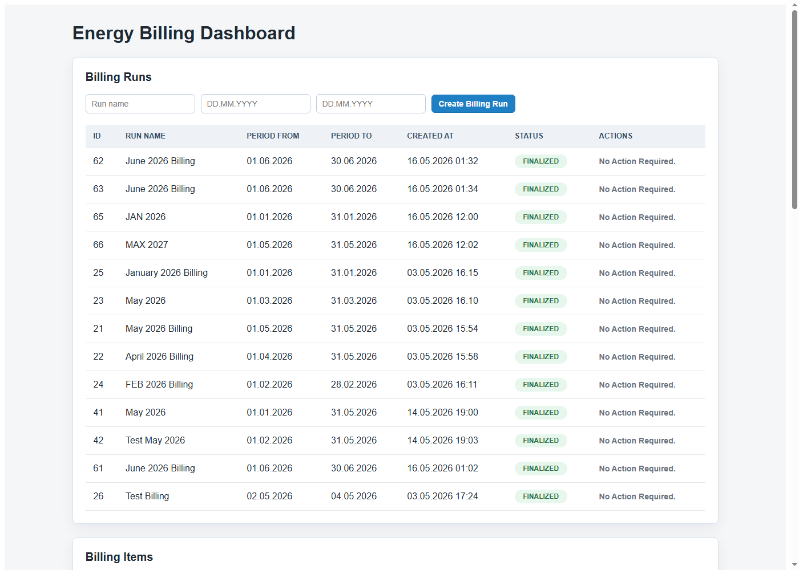
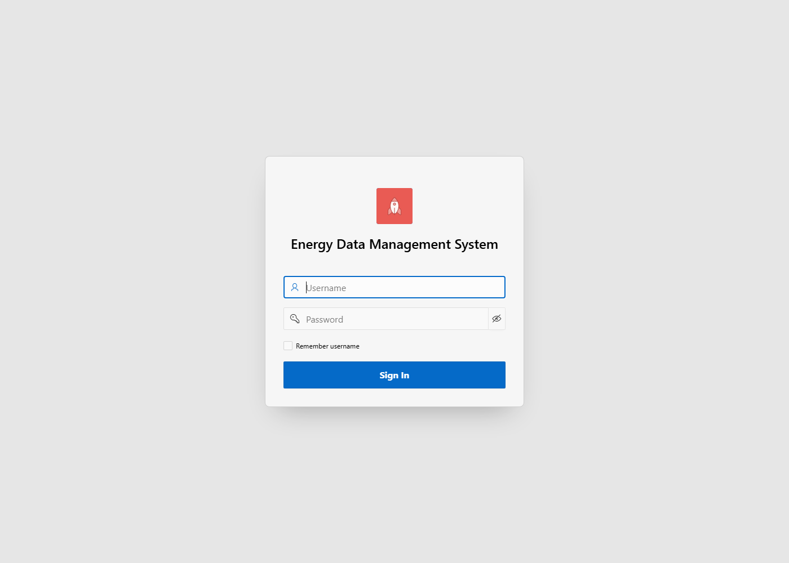

# Energy Data Management and Billing System

Enterprise-style demo project for energy data management and billing workflows.

The project is built around an Oracle database and PL/SQL business layer, with Oracle APEX as the full internal operations UI and a Spring Boot REST API consumed by an Angular dashboard.

## Architecture

```text
Angular Frontend
    -> Spring Boot REST API
        -> Oracle PL/SQL Packages
            -> Oracle Database Tables

Oracle APEX Application
    -> Oracle PL/SQL Packages
        -> Oracle Database Tables
```

This is one backend/business system with two frontends:

- Oracle APEX provides the full admin and operations application.
- Angular provides a modern workflow dashboard and REST integration demo.
- Spring Boot exposes selected billing operations as REST endpoints.
- Oracle PL/SQL contains the core business rules.



## Technology Stack

- Oracle Database
- SQL and PL/SQL
- Oracle APEX
- Java 21
- Spring Boot
- Spring Data JPA
- JdbcTemplate
- Maven
- Angular
- TypeScript
- HTML and CSS

## Core Features

- Customer, meter, consumption, tariff, billing run, and billing item data model
- PL/SQL billing workflow
- Role-based access control tables
- Audit logging for billing tables
- APEX internal application for CRUD and workflow management
- Spring Boot REST API for selected business operations
- Angular billing dashboard
- Create, process, view, and finalize billing runs from Angular

## Billing Workflow

```text
Create Billing Run
    -> Process Billing Run
        -> Generate Billing Items
            -> View Billing Items
                -> Finalize Billing Run
```

## Spring Boot API

Backend runs on:

```text
http://localhost:8081
```

Main endpoints:

```text
GET  /api/health
GET  /api/customers
GET  /api/billing-runs
POST /api/billing-runs
POST /api/billing-runs/{id}/process
POST /api/billing-runs/{id}/finalize
GET  /api/billing-items
```

Swagger UI:

```text
http://localhost:8081/swagger-ui/index.html
```

## Angular Frontend

Angular runs on:

```text
http://localhost:4200
```

Current Angular features:

- Billing run list
- Create billing run form
- Process billing run action
- Finalize billing run action
- Billing items table
- Status badges
- German-style date display

## Public Demo URLs

Public access is provided through Cloudflare Tunnel.

```text
APEX application:
https://apex.amjadalahdal.com

Angular dashboard:
https://angular.amjadalahdal.com

Spring Boot API health check:
https://api.amjadalahdal.com/api/health
```

The public hostnames map to local services:

```text
apex.amjadalahdal.com    -> localhost:8080
angular.amjadalahdal.com -> localhost:4200
api.amjadalahdal.com     -> localhost:8081
```

The APEX root hostname redirects to the application login page:

```text
https://apex.amjadalahdal.com/ords/r/energy_demo/energy-data-management-system/login
```

## Screenshots

Angular billing dashboard:



APEX application login:



Spring Boot API health endpoint:


## Demo Walkthrough

Use APEX as the full internal operations UI:

- manage master data such as customers, metering points, meters, tariffs, and consumption
- manage application users and roles
- inspect billing runs and generated billing items
- demonstrate the back-office application built directly on Oracle

Use Angular as the modern REST-based workflow dashboard:

1. Open `https://angular.amjadalahdal.com`.
2. Create a billing run with a run name and period dates.
3. Process the billing run.
4. Review generated billing items in the Billing Items table.
5. Finalize the billing run.

The API host is used by Angular behind the scenes and is not intended as an end-user interface.

## How To Run

The backend reads database credentials from environment variables:

```text
ENERGY_DB_USERNAME
ENERGY_DB_PASSWORD
```

For local development, create `start-backend.local.bat` and set those variables before calling `start-backend.bat`. The local file is ignored by Git.

Start the backend:

```powershell
cd D:\JavaWorkSpace\energy-api
.\start-backend.local.bat
```

Start the Angular frontend in another terminal:

```powershell
cd D:\JavaWorkSpace\energy-api\energy-ui
npm start
```

Then open:

```text
http://localhost:4200
```

For public access, the local services and the Cloudflare tunnel must all be running:

```text
ORDS/APEX    localhost:8080
Spring Boot  localhost:8081
Angular      localhost:4200
cloudflared  tunnel amjad-shop
```

## Project Purpose

This project was built as a portfolio and interview demo aligned with database-heavy enterprise software in the energy industry.

It demonstrates:

- Oracle database design
- PL/SQL business logic
- APEX application development
- REST API integration with Spring Boot
- Angular frontend integration
- End-to-end billing workflow design

## Alignment With AKTIF Technology Role

The project is aligned with software development for the energy industry and demonstrates the main areas mentioned in the AKTIF Technology role profile:

- Oracle database design, SQL, and PL/SQL
- data modeling around customers, metering points, meters, tariffs, consumption, billing runs, and billing items
- enterprise workflow implementation for energy billing
- Java and Spring Boot REST integration
- Angular and TypeScript frontend development
- HTML and CSS user interface work
- separation of business logic, API integration, and UI layers
